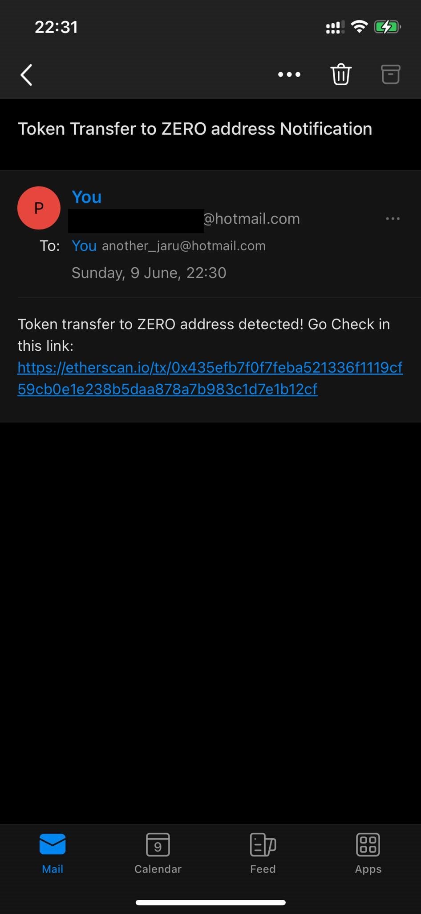

# Ethereum USDT Transfer Monitoring System

This project is designed to monitor USDT transfers to the zero address on the Ethereum mainnet. When a transfer is detected, the system sends an email notification to the specified recipient.

## Prerequisites

- An Infura account to get an API key
- An email account (e.g., Outlook/Hotmail) to send notifications
- A `.env` file with the following environment variables:
  - `INFURA_API_KEY`: Your Infura API key
  - `SENDER_EMAIL`: The email address used to send notifications
  - `SENDER_PASSWORD`: The password for the sender email


## Demo
- This Demo was tested by monitoring USDC instead of USDT because USDT is rarely found in this address.
 


## Addtional Detail  And Technical Questions
- Q1: Please provide technical details (can be as in-depth as pseudo-code and/or an overview of the algorithm or approaches used), including the analysis of why the design is good, compared to other possible designs.

1. **Connect to the Ethereum Node:**
    - Uses the Infura API to connect to the Ethereum mainnet via HTTP..
    - Pseudo Code :
    ```python
    from web3 import Web3, HTTPProvider
    def connect_to_ethereum_node():
    w3 = Web3(HTTPProvider(f"https://mainnet.infura.io/v3/{INFURA_API_KEY}"))
    if w3.is_connected():
        return w3
    else:
        raise ConnectionError("Failed to connect to Ethereum node")
     ```

2. **Start the Listener:**
    - Defines filter parameters to monitor USDT transfers to the zero address.
    - Continuously checks for new events and handles them accordingly.
    - Pseudo Code : 
     ```python
    def start_listener(w3):
    zero_address = "0x0000000000000000000000000000000000000000"
    usdt_address = "0xdAC17F958D2ee523a2206206994597C13D831ec7"

    filter_params = {
        'address': usdt_address,
        'topics': [
            Web3.keccak(text="Transfer(address,address,uint256)").hex(),
            None,
            '0x' + zero_address.replace('0x', '').zfill(64),
        ]
    }

    while True:
        events = w3.eth.get_logs(filter_params)
        for event in events:
            handle_event(event)
        sleep(5)
    ```
3. **Handle Events and Send Email Notifications:**
    - Use the get_logs method from web3.py to create an event filter for the USDT contract’s Transfer event where the recipient is the zero address.
    - Sends an email notification when such an event is detected.
    - Pseudo Code :
    ```python
    import smtplib
    from email.mime.text import MIMEText

    def handle_event(event):
    send_email_notification(event)

    def send_email_notification(event):
    sender_email = os.getenv('SENDER_EMAIL')
    sender_password = os.getenv('SENDER_PASSWORD')
    receiver_email = 'another_jaru@hotmail.com'
    message = MIMEText(f"Token transfer to ZERO address detected! Check the link: https://etherscan.io/tx/{event['transactionHash'].hex()}")
    message['Subject'] = 'Token Transfer to ZERO address Notification'
    message['From'] = sender_email
    message['To'] = receiver_email

    with smtplib.SMTP('smtp.office365.com', 587) as server:
        server.starttls()
        server.login(sender_email, sender_password)
        server.sendmail(sender_email, receiver_email, message.as_string())

     ```

4. **Send Email Notifications:**
    - When a transfer to the zero address is detected, format the event details and send an email notification using SMTP.
    - Configures the email content and recipient details.
    - Pseudo Code :
    ```python
    from web3 import Web3, HTTPProvider
    def connect_to_ethereum_node():
    w3 = Web3(HTTPProvider(f"https://mainnet.infura.io/v3/{INFURA_API_KEY}"))
    if w3.is_connected():
        return w3
    else:
        raise ConnectionError("Failed to connect to Ethereum node")
     ```
Why This Design is Good
1. Simplicity and Clarity:
- The design uses clear and well-defined steps to achieve its goal, making it easy to understand and maintain.
2. Modularity:
- Each function handles a specific part of the process (e.g., connecting to the node, handling events, sending notifications), allowing for easy updates and modifications.
3. Real-time Monitoring:
- The system continuously polls for new events, ensuring timely detection and notification.
4. Cost-effective:
- By leveraging Infura’s free tier and simple SMTP for email notifications, the system minimizes costs.
5. Scalability:
- The system can be easily extended to monitor other tokens or addresses by modifying the filter parameters.


